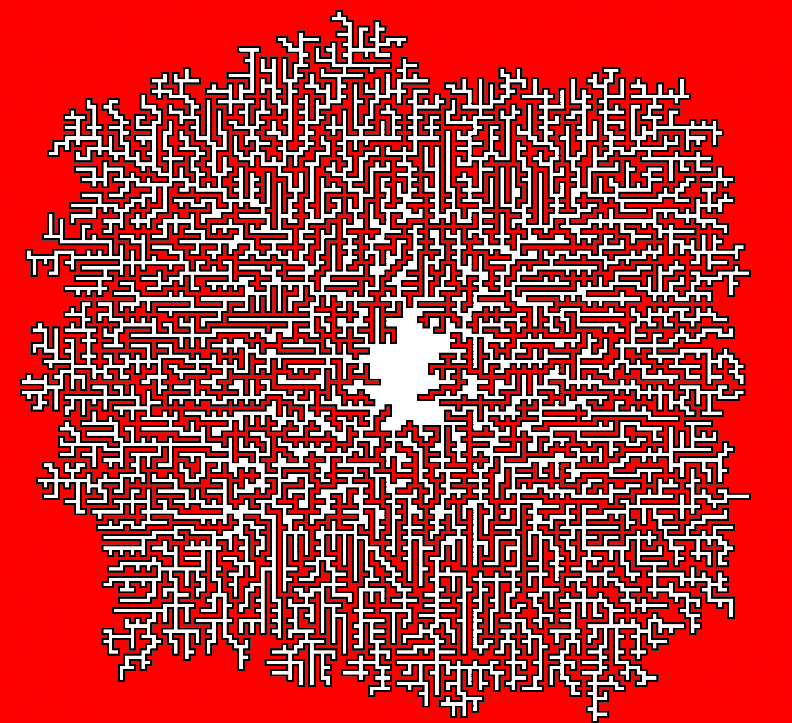
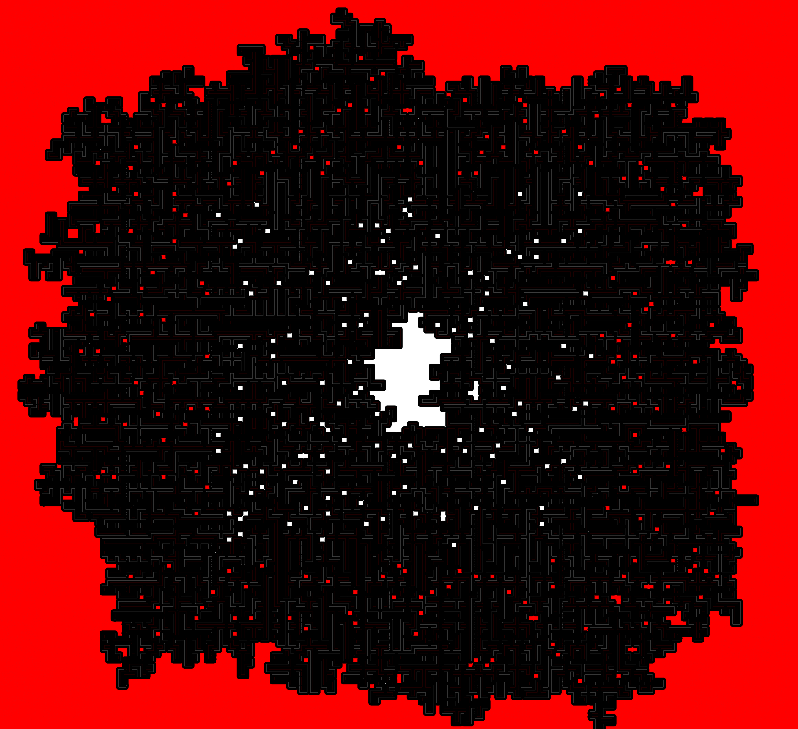
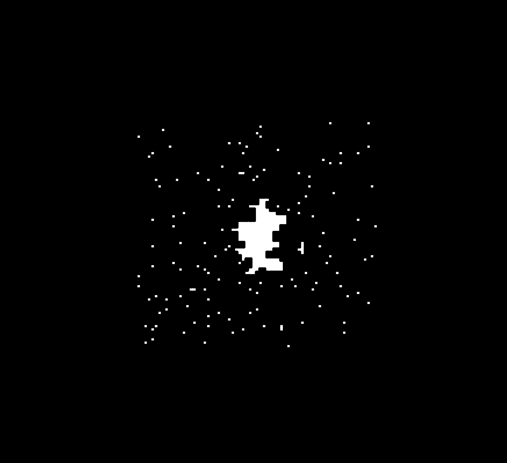

# google sheets commands

The final sheet:

https://docs.google.com/spreadsheets/d/1I8Lkl4IenA2qIGxAlzw_5aNwd0gbEySPqF3P0T1Wv9k/edit#gid=1210892648

Format the data:

```
=REGEXEXTRACT(TO_TEXT(Sheet1!A1); REPT("(.)"; LEN(Sheet1!A1)))
```

We can then run `sol.gs` on the resulting output of the previous command, which will output a path to a different sheet

After, we can simply get the max from the grid:

```
=MAX(2:1000)
```

Get midpoint, and round it:

```
=ROUND(A1/2, 0)
```

Route visualized in sheets


# part 2

For part 2, I took the output image of part 1 as PDF from google sheets, exported it to photoshop and created B/W version of it and finally colored the middle (not inside the loop) and outside (also not inside the loop) with red, and counted the area of white pixels with openCV (there happened to be a post in slack overflow that had exactly what I needed, which can be seen in `colors.py`).


The white blocks were not equally sized due to resolution/import issues (i'm not an image processing person!), but I could see that the blocks were ~5 pixels tall and 24-26 pixels wide.

I then looped through 24 - 26 pixels, and also taking the midpoints (24.5, 25, 25.5).. and tried to submit the solutions. Luckily one of the numbers matched almost exactly to the answer (325.28979591836736). I tried both 326 and 325, and 325 worked.


## and of course that was wrong.

The second attempt was a bit more reasonable: I multiplied all the sides by 3 on the apps script, and made the cells squares (see output_3x onm the sheet).

This results on a picture that can be floodfilled from outside in photoshop:



The black area can then be selected to remove all the in-between red zones, leaving only the white areas that are larger than the distance between two red zones:



Simplifying futher and taking a 50% threshold bitmap image of the resulting picture gets us:



However, for each 2*2 block that counts as an opening, half of each side is not actually part of the box (it comes from the border), meaning the actual size of of each square is about 20x20 pixels (-5 from all sides) Reducing the are by stroke = 8px means that we get ~13-14 x 12-14px for the tiles not in the middle, and for the middle tiles we get for the most part normal 20*20 tiles. Measuring the sides in the boundary areas tiles in practise (after threshold -> bitmap mapping, we get areas of roughly 156 (or 12.5 for sides on average).

In the middle, we go 8px deep with the stroke, meaning that for some of the side tiles, we eliminate 2px less than we should, rough count of the length (with the photoshop ruler tool) (2200 * 2px) gives us extra 2664 pixels, which we can eliminate

The number of pixels in middle is about 78781 and on the outside about 21890

Trying slightly different values for the most inaccurate part (are measurement in the middle, having both the potential inaccuracy of stroke not being square shaped on edges and the line measurement being inaccurate

(78781 - (2100 * 2)) / (20 * 20) + 21890 / (156) = 326.7730128205128
(78781 - (2200 * 2)) / (20 * 20) + 21890 / (156) = 326.2730128205128
(78781 - (2300 * 2)) / (20 * 20) + 21890 / (156) = 325.7730128205128
(78781 - (2400 * 2)) / (20 * 20) + 21890 / (156) = 325.2730128205128

