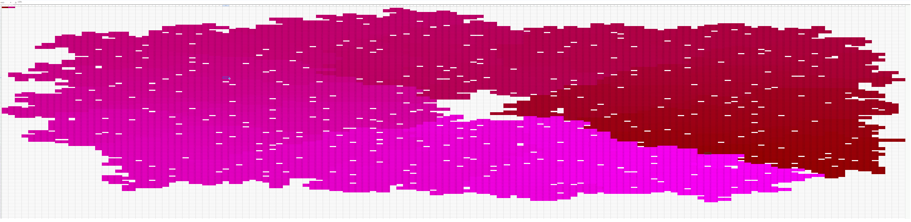
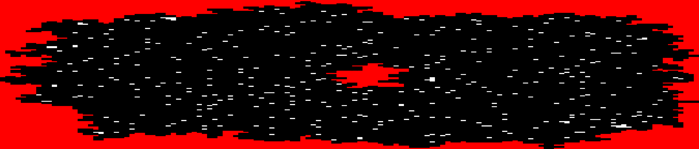

# google sheets commands

Format the data:

```
=REGEXEXTRACT(TO_TEXT(Sheet1!A1); REPT("(.)"; LEN(Sheet1!A1)))
```

Get the max from the grid:

```
=MAX(2:1000)
```

Get midpoint, and round it:

```
=ROUND(A1/2, 0)
```

Route visualized in sheets



For part 2, I took the output image of part 1 as PDF from google sheets, exported it to photoshop and created B/W version of it, with the middle (not inside the loop) and outside (not inside) with red, and counted the area of white pixels with openCV (there happened to be a post in slack overflow that had exactly what I needed, which can be seen in `colors.py`).



The white blocks were not equally sized due to resolution/import issues (i'm not an image processing person!), but I could see that the blocks were ~5 pixels tall and 24-26 pixels wide.

I then looped through 24 - 26 pixels, and also taking the midpoints (24.5, 25, 25.5).. and tried to submit the solutions. Luckily one of the numbers matched almost exactly to the answer (325.28979591836736). I tried both 326 and 325, and 325 worked.